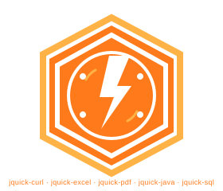

<p align="center">
  
</p>

<p align="center"><b>JQuick JSON —— 轻量、高效的 Java JSON 处理库。</b></p>

<p align="center">
  <b>简体中文</b> | <a href="./README.md">English</a>
</p>

---

## 目录

- [项目简介](#项目简介)
  - [核心优势](#核心优势)
  - [适用场景](#适用场景)
  - [核心技术特点](#核心技术特点)
- [快速引入](#快速引入)
- [核心功能](#核心功能)
  - [1. 对象转 JSON 字符串](#1-对象转-json-字符串)
  - [2. JSON 格式化美化输出](#2-json-格式化美化输出)
  - [3. POJO 与 JSON 双向转换](#3-pojo-与-json-双向转换)
  - [4. 变量合并渲染](#4-变量合并渲染)
  - [5. JSON 字符串反序列化为对象](#5-json-字符串反序列化为对象)
- [性能优化特性](#性能优化特性)
- [基准性能测试](#基准性能测试)
- [版本迭代说明](#版本迭代说明)
- [开源支持](#开源支持)

## 项目简介

一个面向 Java 的轻量、高性能 JSON 处理库，采用哈希映射作为核心数据存储。它提供简单高效的 API，用于 JSON 解析、生成、对象转换与变量合并，并通过字节码优化实现极致性能。

### 核心优势

- **轻量**：`JSONObject` 与 `JSONArray` 底层基于 `LinkedHashMap` / `ArrayList`，并实现标准 `Map` / `List` 接口，无重型依赖、无私有数据模型。
- **高效**：自 `1.4.0` 起，POJO ↔ JSON 互转由运行时动态生成的字节码 Bean 访问器驱动，配合按类型缓存与反射兜底。
- **零冗余**：API 简洁——`serialize` / `deserialize`、`fromBean` / `toBean`、`prettyPrint` 与变量渲染。
- **高兼容**：支持普通 POJO、嵌套 Bean、集合、数组、`Date`、`BigDecimal`、枚举以及格式化字段；无法生成字节码时自动回退到反射实现。
- **变量渲染**：序列化时从 `JContext` 解析 `${...}` 占位符。

### 适用场景

- Web API、RPC 报文中 POJO 的序列化与反序列化。
- 使用动态变量渲染配置或模板 JSON。
- 合并多份 JSON 文档（深度合并或浅合并）。
- 为日志、调试与文档格式化输出 JSON。

### 核心技术特点

- 基于哈希映射的 `JSONObject` / `JSONArray`，实现 `Map` / `List`。
- 基于 ANTLR4 的 JSON 解析器（语法驱动的词法分析、语法分析与 Visitor）。
- 通过 [jquick-asm](https://github.com/paohaijiao/jquick-asm) 动态生成字节码 Bean 访问器，并提供反射兜底。
- 字段元信息缓存与注解支持（`@JSONField`、`@JSONIgnore`）。
- 深度合并与浅合并策略。
- 美化打印、JSON 校验与转义工具方法。

## 快速引入

在 `pom.xml` 中添加依赖：

```xml
<dependency>
    <groupId>io.github.paohaijiao</groupId>
    <artifactId>jquick-json</artifactId>
    <version>1.5.0</version>
</dependency>
```

> **版本说明**：最新版本为 `1.5.0`，要求 JDK 8 及以上。

## 核心功能

以下示例统一复用如下 POJO：

```java
public class User {
    private String name;
    private Integer age;
    private Date createdAt;
    // 省略 getter / setter
}
```

### 1. 对象转 JSON 字符串

```java
User user = new User("John", 30);
JSONSerializer serializer = JSONSerializerFactory.getDefaultSerializer();
String json = serializer.serialize(user);
// {"name":"John","age":30}
```

### 2. JSON 格式化美化输出

`JSONSupport.prettyPrint` 可按指定缩进宽度对 JSON 字符串进行美化。

```java
String json = serializer.serialize(user);
String pretty = JSONSupport.prettyPrint(json, 3);
System.out.println(pretty);
```

输出结果：

```json
{
   "name" : "John",
   "age" : 30
}
```

`JSONSupport` 还提供 `toJsonString(Object)` 通用序列化与 `isValidJson(String)` 轻量校验方法。

### 3. POJO 与 JSON 双向转换

`JSONObject` 支持 POJO 与基于哈希映射的 JSON 模型双向转换。

```java
// POJO -> JSONObject
JSONObject jsonObject = new JSONObject().fromBean(user);

// JSONObject -> POJO
User copy = jsonObject.toBean(User.class);

// Map <-> JSONObject
JSONObject fromMap = new JSONObject(map);
Map<String, Object> toMap = jsonObject.toMap();
```

字段映射由注解控制：

```java
public class User {
    @JSONField(name = "user_name")
    private String name;

    @JSONField(format = "yyyy-MM-dd HH:mm:ss")
    private Date createdAt;

    @JSONIgnore
    private String internalToken;
}
```

- `@JSONField(name = ...)`：自定义 JSON 键名。
- `@JSONField(format = ...)`：格式化 `Date`、`BigDecimal`、`Float`、`Double`、`Integer`、`Long` 与 `Boolean` 字段。
- `@JSONIgnore`：序列化与反序列化时忽略该字段。

### 4. 变量合并渲染

通过 `JContext` 创建序列化器，在字段值中使用 `${...}` 占位符，序列化时会从上下文解析并渲染变量。

```java
JUserModel template = new JUserModel("${key}", "${value}");

JContext context = new JContext();
context.put("key", "key1");
context.put("value", "key2");

JSONSerializer serializer = JSONSerializerFactory.createJQuickSerializer(context);
String json = serializer.serialize(template);
// {"name":"key1","value":"key2"}
```

JSON 文档同样支持深度合并与浅合并：

```java
JSONObject deep = first.deepMergeWith(second);      // 递归合并嵌套对象
JSONObject shallow = first.shallowMergeWith(second); // 仅合并顶层键
```

### 5. JSON 字符串反序列化为对象

```java
String json = "{\"name\":\"John\",\"age\":30}";
JSONSerializer serializer = JSONSerializerFactory.getDefaultSerializer();
User user = serializer.deserialize(json, User.class);
System.out.println(user.getName()); // John
```

`deserialize` 同样支持目标类型为 `JSONObject`、`JSONArray`、数组以及 `Collection` 子类。

## 性能优化特性

自 `1.4.0` 起，POJO 与 JSON 之间的互转（`toBean` / `fromBean`）默认基于 [jquick-asm](https://github.com/paohaijiao/jquick-asm) 动态字节码生成，核心优化点：

- **字节码 Bean 访问器**：首次使用某个类型时，用 jquick-asm 在运行时生成一个访问器类（命名空间 `com.github.paohaijiao.mapper.gen.*`），将字段读写编译为直接的 getter/setter 调用（`INVOKEVIRTUAL`），彻底替代逐字段反射，且每个类型只生成一次并缓存。
- **反射兜底**：类型无公共无参构造器、字段缺少 getter/setter、或为接口/抽象类时，自动回退到反射实现（`JReflectionBeanAccessor`），功能与行为不受影响。
- **元信息缓存**：字段名、`@JSONField` 名称/format、`@JSONIgnore` 等元信息每个类型只解析一次，序列化/反序列化期间零重复解析。
- **缺陷修复**：修复 `fromBean` 在字段值为 `null` 时的 NPE、重复的集合/日期类型分派分支。
- **热路径降噪**：移除反序列化热路径上逐次打印解析结果的日志输出（字符串拼接 + 控制台 I/O）。

## 基准性能测试

项目内置基准测试（[JBeanAccessorBenchmarkTest](src/test/java/com/github/paohaijiao/JBeanAccessorBenchmarkTest.java)），运行方式：

```bash
mvn test -Dtest=JBeanAccessorBenchmarkTest
```

下表为 5 字段 POJO（String / Integer / int / boolean / long）在本机（JDK 1.8.0_191 / Windows 10）测得，仅供参考，建议在目标环境复测：
ns：纳秒/op：一次操作

| 场景 | 反射 ns/op | 字节码 ns/op | 加速比 |
| ---- | ---------- | ------------ | ------ |
| `accessor.get`（单字段读） | 12.2 | 5.3 | 2.3x |
| `accessor.set`（单字段写） | 53.3 | 1.0 | 54.0x |
| `accessor.create`（实例创建） | 2.6 | 1.4 | 1.8x |
| `fromBean`（bean → JSONObject） | 238.8 | 225.8 | 1.1x |
| `toBean`（JSONObject → bean） | 323.4 | 34.5 | 9.4x |
| `serialize` 完整链路 | - | 5,780 | - |
| `deserialize` 完整链路 | - | 19,277 | - |

> 说明：字段写入（`accessor.set`）与 `toBean` 收益最为显著（可达数十倍）；`fromBean` 的主要开销在字段类型分派与 Map 构建，字段读取只占小部分，因此提升相对有限。

## 版本迭代说明

| 版本 | 核心更新 |
| ---- | -------- |
| **1.5.0** | 父工程升级至 javelin `2.7.0`，jquick-asm 升级至 `1.3.0`；新增 JUnit 测试依赖与可运行示例。 |
| **1.4.0** | POJO ↔ JSON 互转（`toBean` / `fromBean`）引入字节码 Bean 访问器动态生成，新增反射兜底与字段元信息缓存，修复 `fromBean` 的 NPE，并移除反序列化热路径上的冗余日志。 |
| 1.3.0 | 新增中文文档。 |
| 1.2.0 | 提供 JSON 解析与生成 API、JSON 合并、变量（公式）上下文，并发布至 Maven Central。 |

